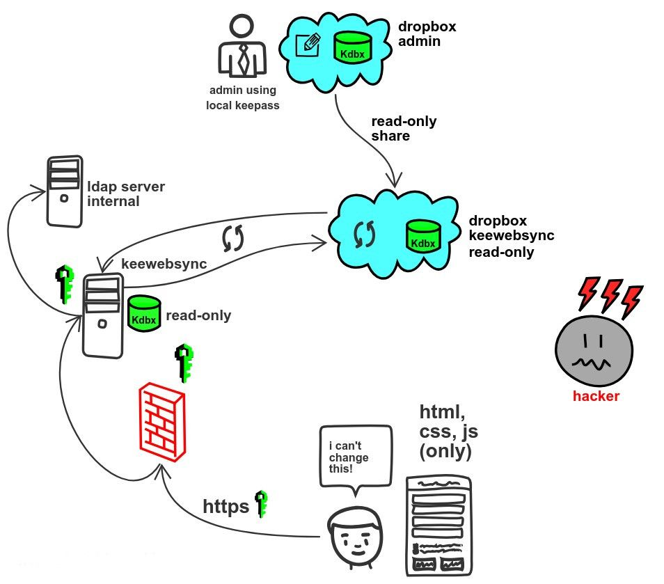
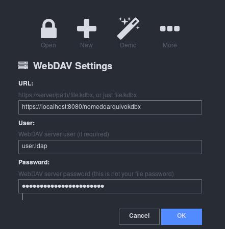

## Keewebsync

Low cost solution for password sync via dropbox with keeweb, through LDAP authentication, managing password db in Kdbx (Keepass format).

#### How it works?

##### Problem

Your boss or someone with permissions to edit a kdbx password database (Keeepass) shares that bank via a personal dropbox, but he wants all division employees to access the file but not be able to edit it, moreover, for security issues, he wants that the use whether via web (internal and external) with front-end technologies and does not want the opening of the bank to run in back-end language, such as PHP or Python. Other than that, he still want to have the access registry to the bank de dados, such as time and user. The organization has an LDAP server for internal employee authentication. Many requirements huh!

##### Solution



This solution works with the following requirements, for you who are building the solution:

- The privileged user has write access to kdbx and shares it in a personal or professional of the your dropbox account.

- This user shares the file as read-only for you.

- The account that will have read-only access can be an account created for this purpose only. This will be the account that you will synchronize with the *container* that will be created in this tutorial.

- Within the organization you must have an LDAP server for authentication to the keewebsync service.

- Docker host available for creating micro services.

#### Generating .pem file (HTTPS)

Generate self-signed certificates and keys that will be part of the keewebsync container settings: Change to their respective configuration.

```bash
$ openssl req -new -newkey rsa:4096 -x509 -sha256 -days 365 -nodes -out keewebsync.crt -keyout keewebsync.key -subj "/C=BR/ST=Ceara/L=Fortaleza/O=Org/OU=DIV/CN=keeweb"
$ cat keewebsync.key keewebsync.crt > keewebsync.pem
```



#### Build (generating the images)

Clone repository

```bash
git clone https://github.com/marlluslustosa/keewebsync
```

For security reasons, the entire project will be done by compiling the image locally, to avoid working with the ready image made available in the original author's repository. The project consists of two images: one that contains the static files of the keeweb project and another that contains the settings for uploading a dropbox instance. All settings have been added within the docker-compose.yml file.

First, you must change the [docker-compose.yml](./docker-compose.yml) file according to your needs. For example, change the locations where the dropbox volumes will be mounted.

```docker
version: '3.3'

services:
  keewebsync:
    build:
      context: .
    container_name: keewebsync
    environment:
      LDAPDRCIP: 10.20.1.2 #ip ldap 
      LDAPDRCBASEDN: dc=smb,dc=OTR,dc=br # ldap basedn
      LDAPDRCBINDDN: cn=Administrator,cn=Users,dc=smb,dc=OTR,dc=br # bindn do servidor ldap
      KDBXNAME: keepasskdbx # database name (without extension .kdbx)
    env_file:
      ldapdrcpw.env # ldap server access credentials
    ports:
      - "8080:443"
    volumes:
      - type: bind
        source: ./dropbox-main/KDBXFolderName # dropbox folder where kdbx will be (change to your choice)
        target: /var/www/html/webdav/ # don't change
        read_only: true
      - type: bind
        source: /etc/localtime # local time folder
        target: /etc/localtime # don't change
        read_only: true
      - type: bind
        source: ./keewebsync.pem # pem file (generated in the previous step)
        target: /etc/lighttpd/keewebsync.pem # don't change
        read_only: true
    networks:
      - keewebsync-net
    depends_on:
      - dropbox

  dropbox:
    build:
      context: ./docker-dropbox
    container_name: dropbox
    environment:
      DBOX_UID: 1000 # default. type "$ id " to know which default id
      DBOX_GID: 1000 # default. type "$ id " to know which default id
    volumes:
      - type: bind
        source: /etc/localtime # local time folder
        target: /etc/localtime # don't change
      - type: bind
        source: ./dropbox-settings # settings dropbox account
        target: /opt/dropbox/.dropbox # don't change
      - type: bind
        source: ./dropbox-main # dropbox box main (where will the kdbx file be)
        target: /opt/dropbox/Dropbox # don't change
    networks:
      - keewebsync-net

networks:
  keewebsync-net:
    driver: 'bridge'
```

Remembering that the password acess LDAP server must be created inside the ```.env``` file, called in the ```env-file``` option. The contents of the file must be set like this:

```docker
LDAPDRCPW=:EnterPasswordHere
```

After changing all the necessary parameters, execute the build to generate the images and upload the *containers*.

```bash
sudo docker-compose up --build
```

Wait while it installs the base image files. When finished, the *container* keewebsync will probably complain about missing the file and probably won't go up, because the KDBX file is not mounted, since you have not yet mounted the dropbox folder on the container.


So, let's set up the mount points for the *container* dropbox.

```bash
sudo docker logs dropbox
```

The result of this command will contain a link to add the account that contains the KDBX file in the container in question.


Take the link you will see and open it in your browser. Then, enter the credentials in the dropbox account and accept the sync. After doing this, and typing the same command ```sudo docker logs dropbox``` you will see a message that the device is synchronized. Then again run the docker compose command, but now without building the images again and adding the -d option to put them in *background*:

```bash
sudo docker-compose up -d
```


If it happened like the one above, everything is correct and you can go to the browser and type:

```http
https://localhost:8080
```

When you open the application, go to the *More>Webdav* option and at the location you type the server where the file is located and the file name, as in the image below.



After that, you will open the database normally, with read-only access, as defined in sharing the dropbox link sent to you.

The localhost can be changed to a name that can be included in the local DNS service and can be exposed without problems on the internet, through a local reverse proxy, as the following requirements have been fulfilled:

- Access will be read-only.

- The bank originally will need a password to open.

- The entire connection is encrypted via HTTPS.

- As the page is static, it does not contain loopholes from traditional vulnerabilities, such as * jql injection * attacks or the possibility of executing remote code on the server, using * back-end * languages. All the code works on top of HTML, CSS and JavaScript, only.

For added security, you can still add a complementary key file to open the kdbx file. Ask the user who manipulates the password bank to create a key file to open the file, in addition to the symmetric password entered. Then, this file can be shared offline for everyone who will have access to the bank, further increasing the security of the solution.

It is. Questions and suggestions, open an issue or a PR.

:)
